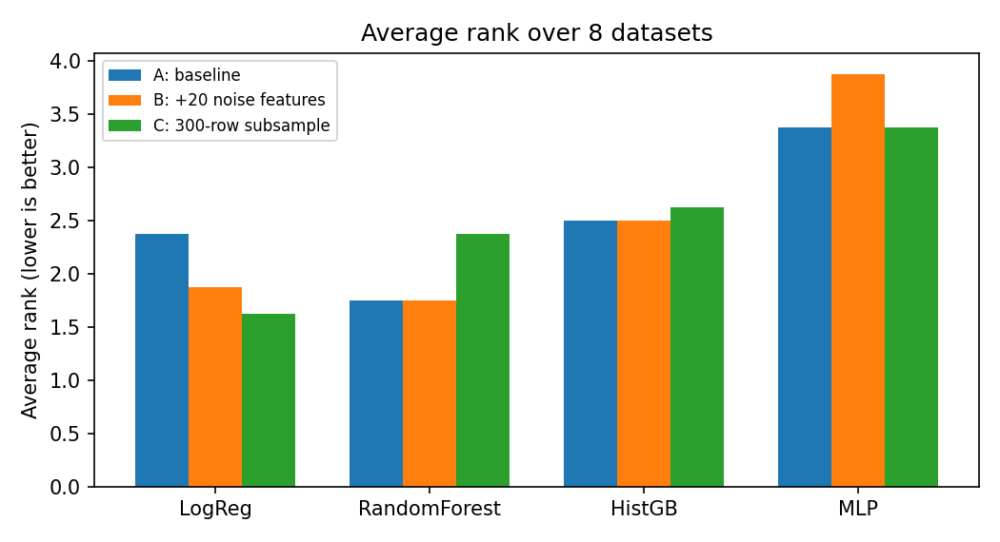
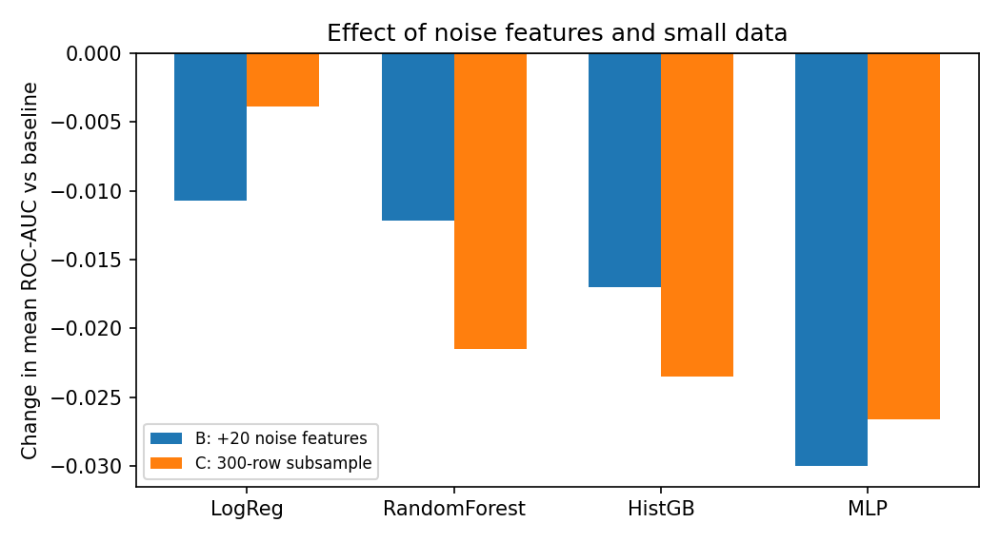

# Tree Ensembles vs. Neural Networks on Small Tabular Data: A Nested-CV Benchmark with Noise and Sample-Size Experiments

**Saqib Ahmed** · October 2026 · *Unreviewed technical report (not peer-reviewed)*
Code and data: this repository (`benchmark.py`, `analyze.py`, `results/`, `figures/`)

## Abstract

Tree-based models are often reported to outperform neural networks on tabular data. We test this claim on eight small binary-classification datasets from OpenML, comparing a tuned logistic regression baseline, random forest, histogram gradient boosting and a multilayer perceptron (MLP). Every model gets the same random-search budget inside nested cross-validation, and we report ROC-AUC, average ranks and Friedman tests. We run three experiments: a baseline, a version with 20 added uninformative features, and a version capped at 300 rows. Random forest has the best average rank in the baseline (1.75), but the difference between models is not statistically significant (Friedman p = 0.092), and it is driven mostly by one dataset. The MLP is consistently ranked last and is hurt most by noise features. With only 300 rows, logistic regression is the best model (average rank 1.62). A tuned linear baseline is therefore a strong competitor on small tabular data.

## 1. Introduction

Gradient-boosted trees and random forests are the default choice for tabular data, and recent benchmarks report that they still beat deep learning on medium-sized tabular datasets [1]. Many practical problems, however, involve only hundreds or a few thousand rows. This report asks three questions on such small datasets:

1. Do tree ensembles still outperform a neural network, and is a tuned linear baseline competitive?
2. How does each model react to uninformative features?
3. How does each model react to a very small training set?

## 2. Related work

Grinsztajn et al. [1] show that tree-based models outperform deep learning on typical tabular data and identify robustness to uninformative features as one reason. Shwartz-Ziv and Armon [2] reach a similar conclusion about the strength of tree ensembles and the cost of tuning deep models. We follow the recommendation of Demšar [3] to compare classifiers across several datasets with rank-based tests, and we use random search for hyperparameter tuning [4]. Our contribution is a small, fully reproducible replication-style study that adds a tuned linear baseline and focuses on small datasets.

## 3. Method

**Datasets.** Eight binary classification datasets from OpenML (data ids in `benchmark.py`): credit-g (31), diabetes (37), blood-transfusion (1464), banknote (1462), phoneme (1489), ilpd (1480), wdbc (1510) and kc1 (1067).
| Dataset | Rows | Features |
|---|---|---|
| credit-g | 1000 | 20 |
| diabetes | 768 | 8 |
| blood-transfusion | 748 | 4 |
| banknote | 1372 | 4 |
| phoneme | 5404 | 5 |
| ilpd | 583 | 10 |
| wdbc | 569 | 30 |
| kc1 | 2109 | 21 |

Sizes range from 569 to 5,404 rows and from 4 to 30 features. In experiment C every dataset is capped at 300 rows, so all eight have the same size there.

**Preprocessing.** Numeric features: median imputation and standardisation. Categorical features: most-frequent imputation and one-hot encoding. Preprocessing is fitted inside each training fold.

**Models.** Logistic regression (L2, tuned C), random forest, histogram gradient boosting (scikit-learn) and an MLP (scikit-learn, early stopping). The search spaces are defined in `benchmark.py`.

**Tuning and evaluation.** Nested cross-validation: 5 outer stratified folds repeated with 3 seeds (15 outer evaluations per dataset and model), and an inner 3-fold random search with 15 iterations per model, scored by ROC-AUC. All models receive the same number of search iterations. The reported value for a dataset and model is the mean ROC-AUC over the 15 outer evaluations.

**Experiments.**
- **A (baseline):** the datasets as they are.
- **B (noise):** 20 extra standard-normal features appended to each dataset.
- **C (small data):** each dataset randomly capped at 300 rows (fixed seed).

**Statistics.** Models are ranked per dataset (rank 1 = best) and ranks are averaged. We use the Friedman test across the 8 datasets and pairwise two-sided Wilcoxon signed-rank tests across datasets. The folds of repeated cross-validation are not independent, so tests are run across datasets, not folds. Pairwise p-values are not corrected for multiple comparisons unless stated.

## 4. Results

### 4.1 Baseline (experiment A)

Mean ROC-AUC per dataset (higher is better):

| Dataset | LogReg | RandomForest | HistGB | MLP |
|---|---|---|---|---|
| banknote | 0.9997 | 0.9998 | 0.9998 | 0.9997 |
| blood-transfusion | 0.7562 | 0.7381 | 0.7355 | 0.7563 |
| credit-g | 0.7905 | 0.7934 | 0.7831 | 0.7704 |
| diabetes | 0.8314 | 0.8317 | 0.8242 | 0.8224 |
| ilpd | 0.7488 | 0.7343 | 0.7187 | 0.7058 |
| kc1 | 0.7971 | 0.8156 | 0.8032 | 0.7997 |
| phoneme | 0.8130 | 0.9600 | 0.9579 | 0.9268 |
| wdbc | 0.9956 | 0.9904 | 0.9932 | 0.9895 |
| **Mean** | 0.8415 | **0.8579** | 0.8520 | 0.8463 |
| **Average rank** | 2.38 | **1.75** | 2.50 | 3.38 |

Random forest has the best mean AUC and average rank and wins 4 of 8 datasets (logistic regression 2, HistGB 1, MLP 1). The Friedman test is not significant at the 5% level (χ² = 6.45, p = 0.092), and no pairwise comparison is significant (smallest p = 0.078, RandomForest vs HistGB and vs MLP).

The random-forest advantage comes mostly from **phoneme**, where logistic regression reaches 0.813 and the tree ensembles about 0.96. Excluding phoneme, logistic regression (mean AUC 0.8456, average rank 2.14) is on par with random forest (0.8433, rank 1.86).

### 4.2 Summary of all experiments

| Experiment | LogReg | RandomForest | HistGB | MLP | Friedman p |
|---|---|---|---|---|---|
| A: baseline, mean AUC (avg rank) | 0.8415 (2.38) | **0.8579 (1.75)** | 0.8520 (2.50) | 0.8463 (3.38) | 0.092 |
| B: +20 noise features | 0.8309 (1.88) | **0.8458 (1.75)** | 0.8350 (2.50) | 0.8163 (3.88) | **0.0034** |
| C: 300-row subsample | **0.8377 (1.62)** | 0.8364 (2.38) | 0.8284 (2.62) | 0.8197 (3.38) | 0.058 |



### 4.3 Effect of noise features and small data

Change in mean AUC relative to the baseline, averaged over the 8 datasets:

| Experiment | LogReg | RandomForest | HistGB | MLP |
|---|---|---|---|---|
| B: +20 noise features | −0.011 | −0.012 | −0.017 | **−0.030** |
| C: 300-row subsample | **−0.004** | −0.022 | −0.024 | −0.027 |



**Noise (B).** The Friedman test is significant (p = 0.0034). The MLP is the worst model (average rank 3.88) and loses the most AUC. RandomForest and HistGB are each significantly better than the MLP (Wilcoxon p = 0.0078 each, uncorrected; this is also the smallest p-value possible with 8 datasets and just below the Bonferroni threshold of 0.05/6 ≈ 0.0083). Logistic regression loses little (−0.011) and stays close to random forest in rank.

**Small data (C).** Logistic regression has the best average rank (1.62) and wins 5 of 8 datasets, losing almost nothing compared with the full datasets (−0.004), while the other three models lose 0.022 to 0.027. The Friedman test is borderline (p = 0.058). Logistic regression is better than the MLP (p = 0.016, uncorrected), which does not remain significant after Bonferroni correction. Phoneme remains a tree-ensemble win.

**Cost.** Mean time per outer fold including the random search, baseline experiment: logistic regression 0.9 s, HistGB 6.2 s, MLP 6.7 s, random forest 21.1 s. Equal search iterations therefore do not mean equal compute.

## 5. Discussion

1. **Trees only partly "still win".** Random forest is the best model on average, in line with [1], but the margin over logistic regression is small (+0.016 AUC) and not significant, and it largely disappears without one dataset. On most of these small datasets, a regularised linear model is as good as the ensembles. A likely explanation for phoneme is that its decision boundary is strongly non-linear, but we did not test this.
2. **The MLP is the weakest and the most fragile.** It is ranked last in all three experiments (3.38, 3.88, 3.38) and degrades most with noise features. This agrees with the finding in [1] that neural networks are hurt by uninformative features.
3. **Logistic regression was robust to noise here.** This differs from what is often assumed. A plausible reason is that the tuned L2 penalty shrinks the weights of noise features, but we did not test this explanation.
4. **Small data favours simple models.** Flexible models lose more when data is scarce, which matches common practice of trying a linear baseline first.

Practical takeaway: always include a tuned linear baseline, and use random forest as a robust tree-based default.

## 6. Limitations

- Only 8 datasets, all binary classification, evaluated with ROC-AUC. With 8 datasets the Wilcoxon test has little power, and the smallest possible two-sided p-value is 0.0078.
- Pairwise p-values are uncorrected, and several are near the 5% level; they should be read as indications, not proof.
- A small search budget (15 iterations, 3 inner folds) and search spaces chosen by the author. Better tuning might change the ranking, especially for the MLP and HistGB.
- The noise experiment uses one type (Gaussian) and one level (20 features). The small-data experiment uses a single fixed random subsample per dataset.
- Equal iterations, not equal compute time.
- Only scikit-learn implementations. XGBoost, LightGBM and modern deep tabular models (for example FT-Transformer) are not included.

## 7. Conclusion and future work

On eight small binary datasets, random forest is slightly but not significantly better than a tuned logistic regression at baseline and under noise, logistic regression is best on very small samples, and the MLP is consistently last and most sensitive to uninformative features. Future work: more datasets from a standard suite, several noise levels and learning curves, time-matched tuning budgets, additional models (gradient boosting libraries and deep tabular architectures), and regression tasks.

## Reproducibility

```bash
pip install -r requirements.txt
python benchmark.py --source openml --seeds 3 --budget 15                    # A
python benchmark.py --source openml --seeds 3 --budget 15 --noise 20         # B
python benchmark.py --source openml --seeds 3 --budget 15 --subsample 300    # C
python analyze.py --results results --figures figures
```

## References

1. L. Grinsztajn, E. Oyallon, G. Varoquaux. *Why do tree-based models still outperform deep learning on typical tabular data?* NeurIPS 2022, Datasets and Benchmarks Track.
2. R. Shwartz-Ziv, A. Armon. *Tabular data: Deep learning is not all you need.* Information Fusion, 81, 2022.
3. J. Demšar. *Statistical comparisons of classifiers over multiple data sets.* Journal of Machine Learning Research, 7, 2006.
4. J. Bergstra, Y. Bengio. *Random search for hyper-parameter optimization.* Journal of Machine Learning Research, 13, 2012.
